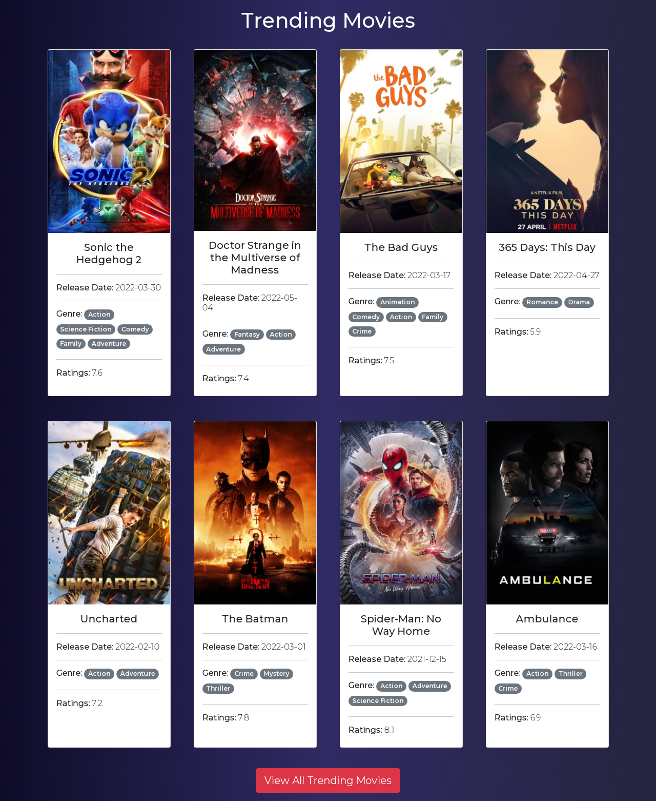
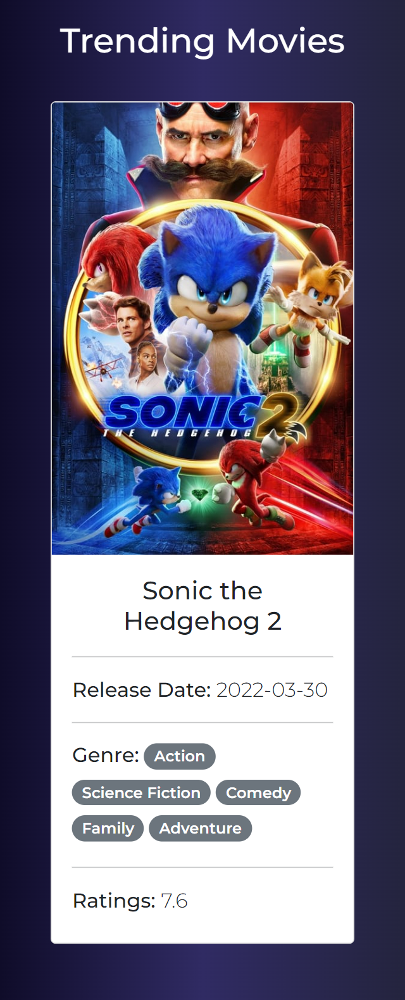
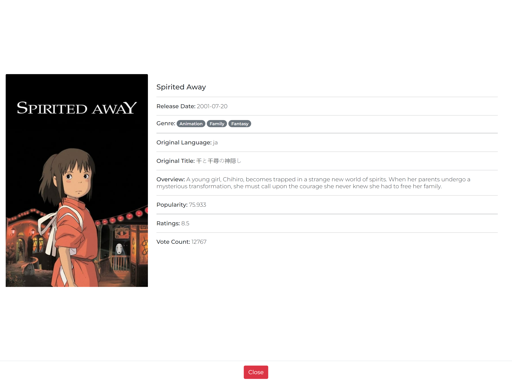
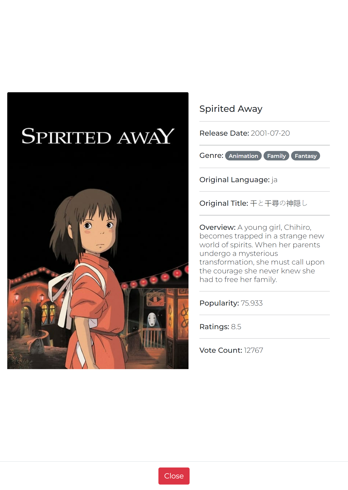

# kona-frontend

Live Site Link: [https://movie-search-portal.netlify.app/](https://movie-search-portal.netlify.app/)

---

## `Key Features:`

1. A responsive landing page that has 3 categories of movies, such:
    - trending movies
    - top rated movies
    - upcoming movies
2. In landing page each category of movies is a collection of eight movies with a *view all* button at the end.
3. Clicking on the *view all* button -
    - will redirect the user to a new page. 
    - contents of this page depends on the category the user has clicked upon.
5. User can view all the movies through pagination.
6. In that page each movie has -
    - a *Show Movie Details* button. 
    - by clicking this button user can see movie's detail information.
6. User can also search for movies within the current page.
7. User can search through movies based on these 3 filters:
    - *movie name*
    - *release year*
    - *genre*

## `Front-End Technologies:`

- React
- Bootstrap 5
- Netlify

[click on this link](#my-multi-word-header)

## `Project Architecture:`

This part of the doc resembles the whole coding flow of this repository. This project mostly has 5 *components* such:
1. [LandingPage](#landingpagejs)
2. [ShowEightMovies](#showeightmoviesjs)
3. [SingleMovie](#singlemoviejs)
4. [MovieModal](#moviemodaljs)
5. [ShowAllMovies](#showallmoviesjs)

---

### [App.js](./src/App.js) : 
This mostly controls the routers. All the routers I've used in our website is included here.

---

### `LandingPage.js`: 
It renders *ShowEightMovies* component three times with different props. It also calls the api to fetch the movies of each categories.

---

### `ShowEightMovies.js`: 
This component renders *SingleMovie* component based on the *props* it got from *LandingPage* component. 

---

### `SingleMovie.js`: 
This can be treated as the soul component of this project. It renders react-bootstrap's *Card* component. Each card contains movie's poster, title, release date, genre and ratings. And this also renders the *MovieModal* component.

---

### `MovieModal.js`: 

It renders react-bootstrap's *Modal* component to show movie details. The modal only appears when the user clicks on *Show Movie Details* button.

---

### `ShowAllMovies.js`: 
This component renders the search bar, search filter, movies and pagination. It makes api call on every time the user paginates to a different page. 

---

### `genre.js`: 
This is isn't a component. This file contains some of the helper functions that I've developed while building this project. This file is located under *utility* folder.

---

screenshots\

screenshots\3.landing_page_mobile.png
screenshots\4.png
screenshots\5_movie_details_desktop.png
screenshots\6_movie_details_tablet.png
screenshots\7_movie_details_phone.png

## `Screenshots:`

- Landing Page : Desktop
    
    

---

- Landing Page : Tablet
    
    

---

- Landing Page : Mobile
    
    

---

- All Top Rated : Desktop
    
    

---

- Movie Details : Desktop
    
    

---

- Movie Details : Tablet
    
    

---

- Movie Details : Mobile
    
    