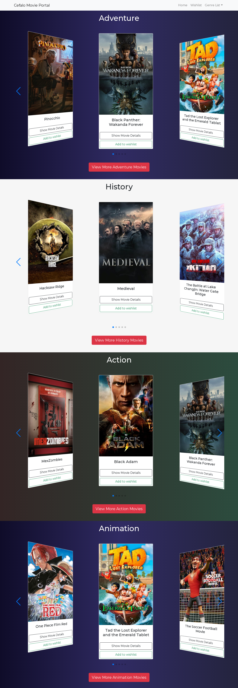
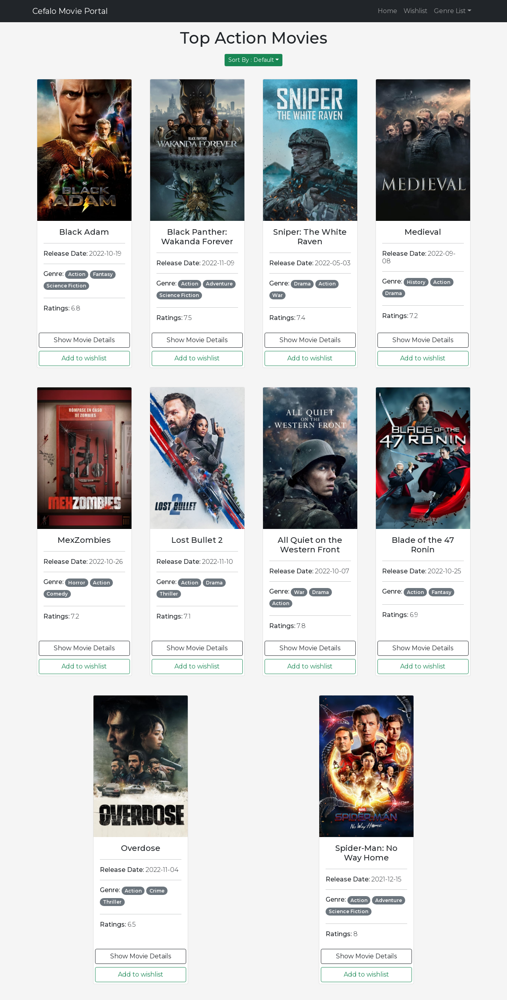
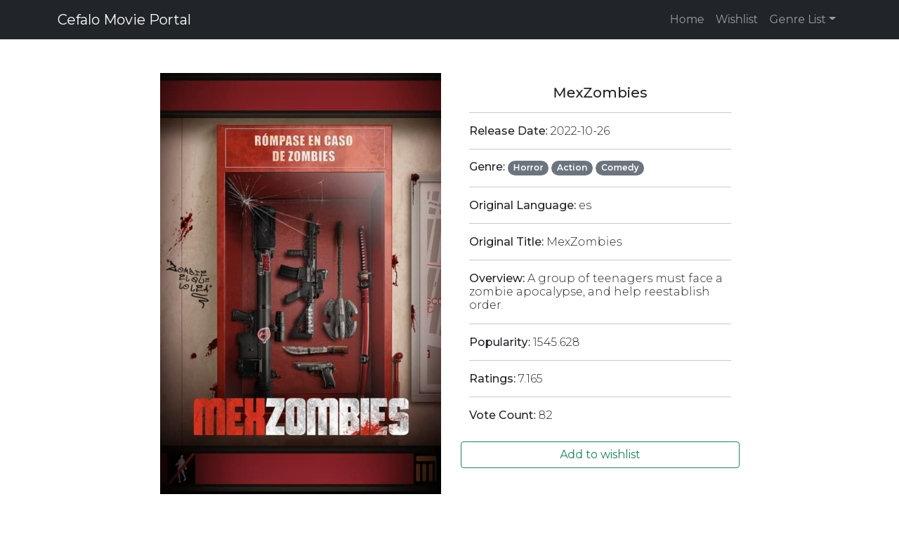
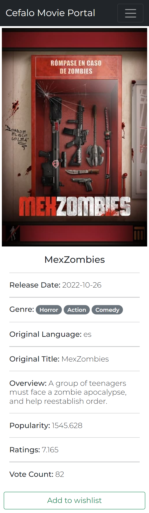

# cefalo-frontend-react

Latest live site (cefalo): [https://cefalo-movie-portal.netlify.app/](https://cefalo-movie-portal.netlify.app/)

~~Previous version live site: [https://movie-search-portal.netlify.app/](https://movie-search-portal.netlify.app/)~~

---
## `How To Run:` 

1. You need to have *node.js* and *npm* installed in your system. 
    - It's suggested to use *node* `v14`, and *npm* `v6`.
2. Clone this repository by the following command -
    - `git clone https://github.com/saiffardin/movie-search-portal.git`
3. Open up the cloned project in *vs code* editor.
4. Find the `env.txt` file, and rename it to `.env`
4. Open the terminal of *vs code*, and execute the following commands one by one:
    - `npm install`
    - `npm start` 

---

## `Key Features:`

1. The **Landing Page** has these following functionalities:
    - Listing of all the movie genres based on the [get list of genres](#genreList) TMDb API.

    - Random 5 movie names along with its poster image for each movie genre. Poster image of a movie is retrieved using [get movies from a specific genre](#genreSpecificMovies) TMDb API.

    - Each movie genre has a *View More Movies* button. Clicking upon this button takes user to the **Movie Genre Page**.

2. The **Movie Genre Page** has the following functionalities:
     - Listing of 10 movies in that genre.
     - Sorting amongst the list of movies. The sorting is done based on : 
        - *movie name*
        - *released year*
        - *ratings*

3. Each movie `card` has a *Show Movie Details* button. Clicking upon this takes user to the **Movie Details Page**. This page displays the following information about the movie : 

    - Poster image
    - Title
    - Release Date
    - Genre
    - Original Language
    - Original Title
    - Overview
    - Popularity
    - Ratings
    - Vote Count

4. User's **wishlist** functionality:
    - a user can add/remove any movie to his *wishlist* from -
        - *home page*
        - *genre page*
        - *movie detail page*
    - user can find all his wishlist movies in **Wishlist Page**.

## `Front-End Technologies:`

- React
- Bootstrap 5
- Netlify
- Local Storage

## `Project Architecture:`

This part of the doc resembles the whole coding flow of this repository. This project has 9 *components*, such:
1. [NavbarSection](#NavbarSection)
2. [LandingPage](#LandingPage)
3. [ShowMovies](#ShowMovies)
4. [SingleSwiperMovie](#SingleSwiperMovie)
5. [TopMoviesList](#TopMoviesList)
6. [SingleMovie](#SingleMovie)
7. [MovieDetails](#MovieDetails)
8. [Wishlist](#Wishlist)
9. [ButtonsWishlist](#ButtonsWishlist)

---

### [NavbarSection.js](./src/Components/NavbarSection/NavbarSection.js)  : 
This component's responsibility is to show 3 nav menus on every page we route through. With the help of those 3 menus, we can navigate to our *landing page*, *wishlist page*, and any *genre page* we choose upon.

---

### [LandingPage.js](./src/Components/LandingPage/LandingPage.js)  : 
This component finds all the movie genres by calling [get list of genres](#genreList) api. Then it calls [get movies from a specific genre](#genreSpecificMovies) api to find movies of that genre. To show 5 movies of every genre in the landing page, this component uses [ShowMovies](#ShowMovies) component. 

---

### [ShowMovies.js](./src/Components/ShowMovies/ShowMovies.js)  : 
This component uses the *swiper* library, and [SingleSwiperMovie](#SingleSwiperMovie) component to render 5 movies of a specific genre. Also, at the bottom, it has a button called *view more movies*, which takes user to the movie genre page.

---

### [SingleSwiperMovie.js](./src/Components/SingleSwiperMovie/SingleSwiperMovie.js)  : 
The look-and-design of every movie card in the landing page is developed with this component. 

---

### [TopMoviesList.js](./src/Components/TopMoviesList/TopMoviesList.js)  : 
This component renders 10 movies of a certain genre. To render each movie it uses [SingleMovie](#SingleMovie) component. Also, *sorting* is implemented in this component. Users can sort movies based on *movie name*, *release date* and *ratings*. 

---

### [SingleMovie.js](./src/Components/SingleMovie/SingleMovie.js)  : 
This component is being reused in [TopMoviesList](#TopMoviesList) component, and [Wishlist](#Wishlist) component. This component's core responsibility is to design the view of every single movie card used in those components.
It does that with the help of *Card* component provided by react-bootstrap. Each card contains movie's poster, title, release date, genre and ratings etc. 

---

### [MovieDetails.js](./src/Components/MovieDetails/MovieDetails.js)  : 
This component contains the details of a movie, such: movie's title, release date, original language, original title, overview, popularity, ratings and view count.

---

### [Wishlist.js](./src/Components/Wishlist/Wishlist.js)  : 
This component is responsible for the view of *wishlist page*. It gets the wishlist from the browser's *local storage*, and then it uses [SingleMovie](#SingleMovie) component to render the UI.

---

### [ButtonsWishlist.js](./src/Components/Wishlist/ButtonsWishlist.js)  : 
This is a reusable component, which has been used in [MovieDetails](#MovieDetails) , [SingleMovie](#SingleMovie) and [SingleSwiperMovie](#SingleSwiperMovie) components. This component enables user to add or remove a movie to *wishlist* from landing page, genre page and movie details page.

Based on conditional rendering this component shows either *Add to wishlist* button or *Remove from wishlist* button. This component uses browser's *local storage* to add or remove movies from wishlist.

---

## `List of APIs:`

- get list of genres :  `https://api.themoviedb.org/3/genre/movie/list?api_key={{apiKey}}&language=en-US`

- get movies from a specific genre :  `https://api.themoviedb.org/3/discover/movie?api_key={{apiKey}}&with_genres={{genreId}}`

- get a single movie details :  `https://api.themoviedb.org/3/movie/{{movieID}}?api_key={{apiKey}}`

- get movie poster :  `https://image.tmdb.org/t/p/w500/{{imgUrl}}`

---

## `Screenshots:`

- Landing Page: 
    
    

---

- Genre Page: 
    
    

---

- Movie Details Page: 
    
    

---

- Movie Details Page - Mobile: 
    
    

---

